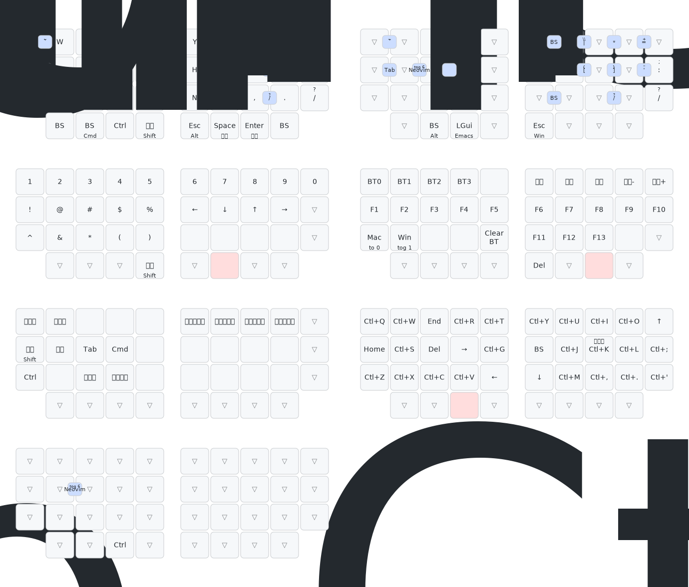

# kobu

自作分割キーボード「kobitokey」にインスパイアされて作った派生キーボード「kobu」の KiCad プロジェクトとファームウェアです。親指キーを追加し、メインキー側を 2 キー削っています。

## ディレクトリ構成

| ディレクトリ | 中身 |
|---|---|
| [`pcb/`](pcb/) | KiCad プロジェクト (PCB / 回路図) |
| [`case/`](case/) | ケースの STEP / STL |
| [`firmware/`](firmware/) | RMK ベースのファームウェア (Rust, thumbv7em-none-eabihf) |
| [`web/`](web/) | kobu 専用 Web キーマップエディタ (WebHID + Vial protocol, React) |

## 開発環境

`flake.nix` が toolchain バージョンの単一情報源。CI も同じ devshell で走るので host とドリフトしない。

### direnv ですぐに使う (推奨)

[nix-direnv](https://github.com/nix-community/nix-direnv) を入れていれば `cd` するだけで対応する devshell が自動起動する:

```sh
direnv allow              # 初回のみ
cd ~/git/private/kobu     # → 全部入り devshell (firmware + web)
cd firmware/              # → firmware-only (Rust + flip-link + probe-rs)
cd web/                   # → web-only      (Node 26 + pnpm)
```

各ディレクトリの `.envrc` が `flake.nix` の対応する `devShells.*` を `use flake` で読み込む構成。

### 手動で起動する場合

```sh
nix develop               # 全部入り
nix develop .#firmware    # firmware のみ
nix develop .#web         # web のみ
```

## 主要部品

- スイッチ: Kailh Choc V2 ホットスワップ（1.00u）
- ダイオード: SOD-123
- コネクタ: Hirose FH12-10S-0.5SH（FFC/FPC 10 ピン, 0.5mm ピッチ）
- MCU: Seeed XIAO nRF52840 BLE（左右親指ユニットに 1 個ずつ）
- トラックボール: PMW3610 光学センサー（左右親指ユニットに 1 個ずつ、3 線 SPI）

## キーマップ



## Vial でキーマップを編集する

ブラウザから kobu のキーマップ・マクロ・コンボを動的に編集できます。RMK が公式に提供しているオンライン編集ルートは Vial 互換のみで、**ブラウザ (vial.rocks) からは USB Raw HID 経由**でしか繋がりません。日常的に BLE で使っていても、編集時だけ USB ケーブルを挿す必要があります。

> **補足**: RMK 0.8 のファームウェア自体は BLE でも Vial プロトコルを喋れます ([`BleVialServer`](https://github.com/HaoboGu/rmk/blob/main/rmk/src/ble/host_service/vial.rs) として実装済み)。ただし Web Bluetooth は HID service UUID `0x1812` をブロックリストで除外しているため vial.rocks からは届きません。Linux/Windows の **Vial デスクトップアプリ** であれば BLE 経由で接続できる可能性がありますが、kobu 上での動作確認はまだ取れていません。

### 必要なもの

- データ通信対応の USB-C ケーブル
- Chromium 系ブラウザ（Chrome / Edge / Brave）。WebHID を使うので Safari と Firefox は不可
- central（左半分）に書き込んだ最新ファームウェア

### 接続手順

1. central を USB ケーブルで PC に接続する（peripheral は接続不要 / 接続しても無視される）
2. <https://vial.rocks> を開く
3. "Authorize device" ボタンを押し、ポップアップで `kobu` を選択
4. キーマップ編集タブで変更したいキーをクリック → 新しいキーコードを選択 → 自動保存

### Unlock chord

キーマップ変更を許可するには、物理位置 `(0, 0)` と `(0, 9)` を**同時押し**します。`(row, col)` は `keyboard.toml` の matrix 上の位置で、論理キーコードではありません。kobu の場合これは:

- `(0, 0)` = 左半分 **外側 pinky**（物理 Q キー位置）
- `(0, 9)` = 右半分 **外側 pinky**（物理 P キー位置）

両手の外側 pinky を同時に押す動作は通常のタイピングではまず起きないので、誤操作で Vial が unlock されることはありません。Vial で Q や P のキーコードを別物に置き換えても、unlock chord は matrix 位置で決まっているため変化しません。

### Layer 3 = Bluetooth 操作レイヤー

Layer 3 row 0 には RMK の "user keycode" 経由で BLE 操作系を割り当てています。Vial 上では `customKeycodes` で定義したラベルで表示されます。

| Vial 上のラベル | 内部の user keycode | 動作 |
|---|---|---|
| BT0 | User0 | BLE プロファイル 0 に切り替え |
| BT1 | User1 | BLE プロファイル 1 に切り替え |
| BT2 | User2 | BLE プロファイル 2 に切り替え |
| BT3 | User3 | BLE プロファイル 3 に切り替え |
| Next BT | User4 | 次のプロファイルに切り替え |
| Prev BT | User5 | 前のプロファイルに切り替え |
| Clear BT | User6 | 現在のプロファイルのペアリング情報を消去 |
| Switch Output | User7 | デフォルト出力先を USB / BLE で切り替え |

ラベルと内部 keycode の対応は `ble_profiles_num = 4` に依存します。`keyboard.toml` の `[rmk]` でこの値を変えた場合、`vial.json` 側の `customKeycodes` も同じ並び規則で書き直す必要があります（RMK 0.8 の `src/keyboard.rs::process_user` 参照）。

Layer 3 に到達するキー（`MO(3)` など）はまだ Layer 0..2 に置いていません。Vial 自体で一時的に任意のキーに `MO(3)` を割り当てて検証してください。

### 工場リセット

書き換えたキーマップを丸ごと捨ててビルド時の keymap に戻したいときは:

1. `firmware/keyboard.toml` の `[storage]` で `clear_layout = true` に変更
2. central をフラッシュ
3. 起動後に `clear_layout = false` に戻し、再度フラッシュ

BLE ペアリング情報も含めて全部消したいときは `clear_storage = true` を使います。

### 既知の制約

- **vial.rocks (Web Bluetooth) からは BLE 経由で繋げない**。HID service が Web Bluetooth のブロックリストにあるため。ブラウザ編集は USB ケーブル必須。
- **Vial デスクトップアプリ + BLE での編集は未検証**。RMK 0.8 の `BleVialServer` は実装されているので Linux/Windows の Vial 経由なら届く可能性あり。動いた人がいたら issue 起票歓迎。
- **peripheral 側（右半分）は USB に挿しても Vial で認識されない**。Vial 通信は central だけが処理します。
- 完全な Web 経由 (Web Bluetooth or WebUSB) 編集は RMK upstream の独自プロトコル ([HaoboGu/rmk#558](https://github.com/HaoboGu/rmk/issues/558)) 完成待ち。
