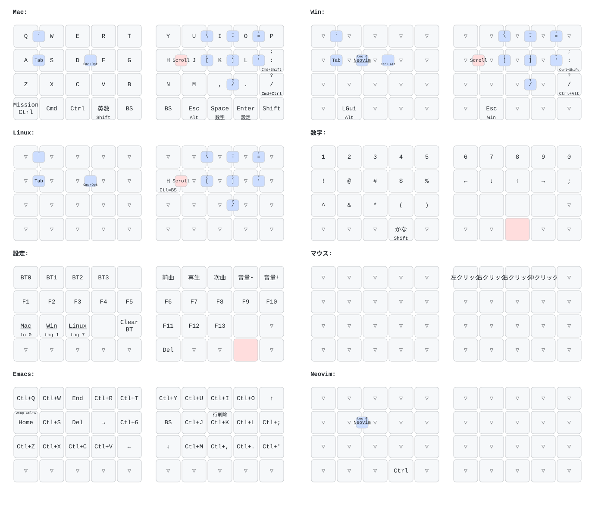

# kobu v2

自作分割キーボード kobu の第 2 世代。v1 との**ハード面の違いは小指列最下段のキーを左右 1 個ずつ追加**したことだけです（19 → 20 キー/半分、計 40 キー）。

初代の PCB / ケース / ファームウェア / Web エディタは [`../v1/`](../v1/) にあります。

## ディレクトリ構成

| ディレクトリ | 中身 |
|---|---|
| [`case/`](case/) | ケースの STL |
| [`pcb/`](pcb/) | KiCad プロジェクト (`left-main` / `right-main` / `thumb-left` / `thumb-right`) |
| [`firmware/rmk/`](firmware/rmk/) | RMK ベースのファームウェア (Rust, thumbv7em-none-eabihf)。v1 の `firmware/rmk` からのフォーク。**クラシック構成（左手=セントラル）** |
| [`firmware/dongle/`](firmware/dongle/) | **Prospector ドングル構成**（ドングル=セントラル+ST7789 画面、左右両手=ペリフェラル）。keymap/behavior は `firmware/rmk/keyboard.toml` と要同期 |
| [`keymap-editor/`](keymap-editor/) | kobu2 専用の Web キーマップエディタ（実機の盤面をクリックして編集 + トラックボール調整）。どちらの構成でも無改修で動く（VID/PID・Via 0xC0 セマンティクス共通）|

## キーマップ



8 レイヤー構成です: **Mac**（デフォルト）/ **Win** / **Linux**（Mac ベース + Ctrl+H → Backspace のみ）/ **数字**（記号・矢印）/ **設定**（BLE プロファイル・F キー・メディア・レイヤー切替）/ **マウス**（トラックボール操作で自動起動）/ **Emacs** / **Neovim**。`▽` は下位レイヤーへの透過。最下行はマトリクス row 3 の実配置どおり「小指最下段キー + 親指クラスタ 4 キー」を 1 行に詰めて描いています。

盤面をまたぐ丸印は同時押し（コンボ）。コンボの出力は素のキーコードなので、Shift はホスト側で自然に効きます（`\` + Shift = `|`、`-` + Shift = `_` …）。

図の元データは [`firmware/rmk/keymap/kobu.yaml`](firmware/rmk/keymap/kobu.yaml) です。`keyboard.toml` とは**自動同期されない**ので、キーマップを変えたら yaml も手で直して描き直してください（devshell が stdout にバナーを出すため `<svg` 以降だけを取ります）:

```sh
cd firmware/rmk/keymap
nix develop ../../../..#firmware --command keymap draw kobu.yaml \
  | sed -n '/^<svg /,$p' > kobu.svg
```

## v1 とのファームウェア差分

- 追加キーは各半分の空いていたマトリクス交点 **ROW3×COL4**（小指列ネット × 親指行ネット）に配線。GPIO 追加なし・マトリクス寸法 (4×10) 変更なしで、keymap 座標では v1 で phantom だった **(3,0) / (3,9)** に載ります。レイヤー 0 の割り当ては左=Mission Control（Consumer 0x29F、Apple キーボードの F3 と同じ usage。2026-08-29 に LShift から変更）/ 右=RShift（他レイヤーは透過）。
  - 実基板で確認済み: 4 基板とも J1 は `1..4=/ROW0../ROW3`, `5..9=/COL0../COL4`, `10=NC` の**同一ピン配置**で、追加キーは各メイン基板の `SW16 = /ROW3 × /COL4`（小指列の最下段、既存最下行の 16mm 下）。/ROW3 が FFC pin4 でメインユニットへ届いています。
  - ⚠️ FFC ケーブルは v1 と逆で**ストレート結線（pin N ↔ pin N）**が必要です。v2 の FFC には電源線が無く（pin10 = NC、メイン基板はスイッチとダイオードのみの完全パッシブ）、誤ったケーブルでも MCU ピンが電源に張り付くことはありませんが、マトリクスは全く読めません。導通チェック手順は `firmware/rmk/keyboard.toml` 冒頭コメント参照。
- 識別子: name/product_name = **kobu2**、product_id = **0x425A**（VID `0x4b4f` と Vial keyboard UID は v1 と共通）。[web editor](../v1/web/rmk-editor/) は v1/v2 両方の PID を受け付けます。2 台目セットは `--features set-2` で **kobu2 squid / 0x425B**（後述）。
- それ以外（build.rs のレジストリパッチ、`src/`、メモリレイアウト、依存クレートのバージョン）は v1 と同一です。
  - うち 3 つは [`firmware/dongle/`](firmware/dongle/) のための 2026-08 追加: `patch_rmk_peripheral_manager_source_disambiguation`（**id≠0 のときだけ発火** → ペリフェラルが id0 の右手のみのクラシック構成では実行時に不活性）、`patch_rmk_split_connect_timeout_widen`（split 接続タイムアウト 5s→12s。クラシック構成では SCANNING_MUTEX が無競合でタイムアウト自体ほぼ発火しないため実質不可視）、`patch_rmk_split_adv_set_token`（広告のセット識別トークン。クラシック構成は `src/set_token.rs` で set 1=`0x41` / set 2=`0x42` を起動時に載せ、2 台同時通電でも左右が誤ペアしない。ドングルの `0x4B` とは別レンジ）。

## ⚠️ build.rs は v1 と同一内容に保つ

v1/v2 の build.rs はどちらも**共有 cargo registry のソースを in-place パッチ**します。両者が同一内容ならパッチは冪等で、どちらのツリーを先にビルドしても安全です。**片方だけにパッチを足して乖離させた場合**は、もう片方をビルドする前に

```sh
cargo clean --release -p rmk -p trouble-host -p rmk-macro
```

で 3 crate をパッチ済みソースから作り直してください（CI はジョブごとに pristine な registry なので無関係）。

## ビルド

v1 と同じで、リポジトリルートの devshell を使います:

```sh
cd v2/firmware/rmk        # direnv が firmware devshell を自動起動
cargo build --release --bin central
cargo build --release --bin peripheral
```

UF2 は CI が [firmware-latest リリース](../../releases/tag/firmware-latest)に `kobu2-rmk-central.uf2` / `kobu2-rmk-peripheral.uf2`（+ `-reset` 版）として公開します。ローカルで作る場合は devshell の `kobu-uf2conv`:

```sh
kobu-uf2conv target/thumbv7em-none-eabihf/release/central    kobu2-rmk-central.uf2
kobu-uf2conv target/thumbv7em-none-eabihf/release/peripheral kobu2-rmk-peripheral.uf2
```

### USB で central に焼く（キーマップ反映）

左手をデータ対応 USB で繋いだ状態で、firmware devshell から:

```sh
# clearlayout → 通常（保存キーマップを keyboard.toml で書き直し。BLE ボンドは残る）
v2/scripts/kobu-flash-central

# キーマップ以外の変更だけなら clearlayout なし
v2/scripts/kobu-flash-central --plain
```

UF2 だけ渡す低レベル版は [`scripts/kobu-flash`](scripts/kobu-flash) です。

## 2 台の kobu2 を同時に使う（セット識別）

クラシック構成はデフォルトで **set 1**（split 広告トークン `0x41`、Mac 上の名前 `kobu2 octopus`、PID `0x425A`）です。2 台目は **同じ左右ペアごと**に `--features set-2` でビルドした UF2 を焼きます（トークン `0x42`、名前 `kobu2 squid`、PID `0x425B`）。トークンが違うと左右の初回ペアリングが相手セットに掴まれません。Mac 上も別名になるのでプロファイルを取り違えにくくなります。

```sh
# 2 台目セット（左右とも同じ feature）
cargo build --release --features set-2 --bin central
cargo build --release --features set-2 --bin peripheral
kobu-uf2conv target/thumbv7em-none-eabihf/release/central    kobu2-rmk-central-set2.uf2
kobu-uf2conv target/thumbv7em-none-eabihf/release/peripheral kobu2-rmk-peripheral-set2.uf2
```

**初回だけ** 各半分を `clear_storage=true` ビルド（または nuke）でボンドを消してから通常 UF2 を焼き、**1 セットずつ電源を入れて**左右を組み直してください。トークン付き広告は旧ファーム（token 0）とも相互に不可視なので、片側だけ古い UF2 のままだと繋がりません。

## XIAO の完全消去（flash nuke）

`kobu2-rmk-*-reset.uf2`（`clear_layout` ビルド）は保存済みキーマップを消すだけで、アプリ本体や BLE ボンドはそのまま残ります。XIAO を**本当にまっさら**（アプリなし・ブートローダのみ）に戻したいときは [`scripts/xiao-nuke.uf2`](scripts/xiao-nuke.uf2) を焼きます。RESET 2 連打 → ドラッグ & ドロップでも、[`scripts/kobu-flash`](scripts/kobu-flash) でも書き込めます:

```sh
# まっさらにするだけ
scripts/kobu-flash scripts/xiao-nuke.uf2

# まっさらにしてからクリーンインストール（nuke 後は自動でブートローダに
# 留まるので、そのまま続けて焼ける）
scripts/kobu-flash scripts/xiao-nuke.uf2 firmware/rmk/kobu2-rmk-central.uf2
```

- 消去範囲は **0x1000–0xC0000**: アプリ + RMK storage（0xA0000–0xC0000 のキーマップ・BLE ボンド・Vial 状態）で、ファームウェアが書き込む領域のすべて。MBR（0x0–0x1000）と Adafruit UF2 ブートローダ（0xF4000–）には触れません。終端を 0xC0000 で止めるのは、出荷版ブートローダ (0.6.1) の UF2 書き込みウィンドウが実測 0x1000–0xEA000 で、ウィンドウ外のブロックは受領カウントされず「全ブロック受領 → 自動リセット」が発火しなくなるため（0xF4000 終端で実害を確認済み。フラッシュ自体は書けるが物理 RESET が必要になる）。なお過去に ZMK を焼いた個体の settings（0xEA000 以降）は UF2 経由では消せないので、必要なら SWD で。
- 実行コードを含まない「全ブロック 0xFF のデータだけ」の UF2 で、ページ消去はブートローダの書き込みパスが行います。書き込み後は先頭ワードが 0xFFFFFFFF（= 有効なアプリなし）になるため、XIAO は再起動後も自動でブートローダ（XIAO-SENSE ドライブ）に留まり、そのまま次の UF2 を受け付けます。
- nRF52840 + Adafruit UF2 ブートローダの組み合わせなら v1 の XIAO にもそのまま使えます。
- キーボード側のボンドは消えますが、**ホスト側（macOS 等）の Bluetooth 設定に残った古いペアリングは別途削除**してください。

再生成は [`scripts/gen-xiao-nuke`](scripts/gen-xiao-nuke)（Python 3 標準ライブラリのみ、出力はバイト単位で再現可能）。CI も再生成してコミット済みファイルと一致することを検証します。
